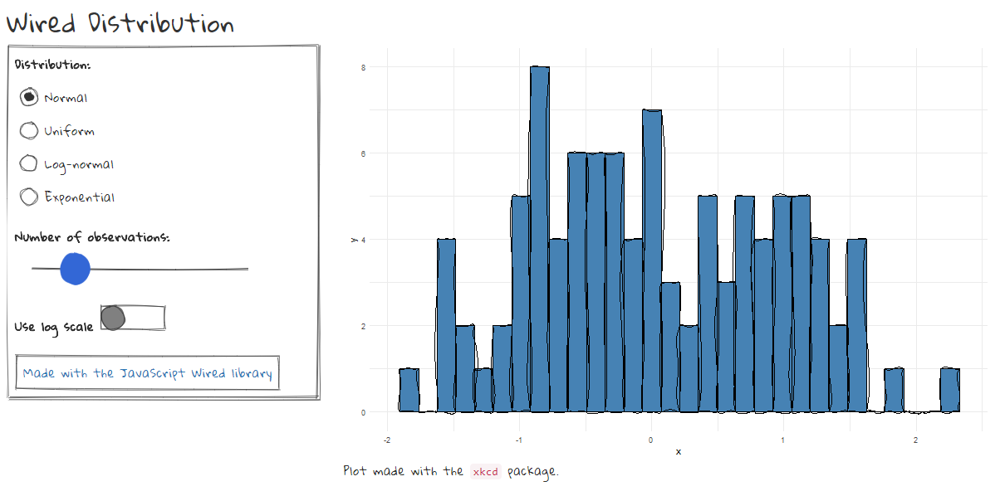

# wired

> Hand drawn UI elements with [wired](https://wiredjs.com/) for [shiny](https://shiny.rstudio.com/) applications.

[](https://travis-ci.org/dreamRs/wired)
[](https://www.tidyverse.org/lifecycle/#experimental)


:warning: Use RStudio >= 1.2 or your default browser :warning:


## Installation

You can install the development version of wired from Github with:

```r
remotes::install_github("dreamRs/wired")
```

## Example




Code:

```r
library(shiny)
library(ggplot2)
library(xkcd)
library(wired)

ui <- fluidPage(
  tags$h2("Wired Distribution"),
  fluidRow(
    column(
      width = 4,
      wired_card(
        width = "100%",
        wired_radio(
          inputId = "dist", label = "Distribution:",
          choices = c("Normal" = "norm",
                      "Uniform" = "unif",
                      "Log-normal" = "lnorm",
                      "Exponential" = "exp")
        ),
        wired_slider(
          inputId = "n", label = "Number of observations:", 
          min = 50, value = 100, max = 300
        ),
        wired_toggle(inputId = "log", label = "Use log scale"),
        wired_button(
          inputId = "wired", 
          label = tags$a(
            "Made with the JavaScript Wired library", 
            href = "https://wiredjs.com/"
          )
        )
      )
    ),
    column(
      width = 8,
      plotOutput(outputId = "plot", height = "500px"),
      tags$span("Plot made with the", tags$code("xkcd"), "package.")
    )
  )
)

server <- function(input, output, session) {
  
  d <- reactive({
    dist <- switch(
      input$dist,
      norm = rnorm,
      unif = runif,
      lnorm = rlnorm,
      exp = rexp,
      rnorm
    )
    
    data.frame(x = dist(floor(input$n)))
  })
  
  output$plot <- renderPlot({
    h <- ggplot(d()) + geom_histogram(aes(x))
    
    if (input$log)
      h <- h + scale_x_log10()
    ggplot() + 
      xkcdrect(
        mapping = aes(
          xmin = xmin,
          xmax = xmax,
          ymin = 0,
          ymax = count
        ),
        data = layer_data(h),
        fill = "steelblue", colour = "black"
      ) + 
      theme_minimal()
  })
  
}

shinyApp(ui, server)
```


## Font

Default font is [Gloria Hallelujah](https://fonts.google.com/specimen/Gloria+Hallelujah) by Kimberly Geswein.
You can turn it off and keep only UI elements with :

```r
options("GloriaHallelujah" = FALSE)
```


